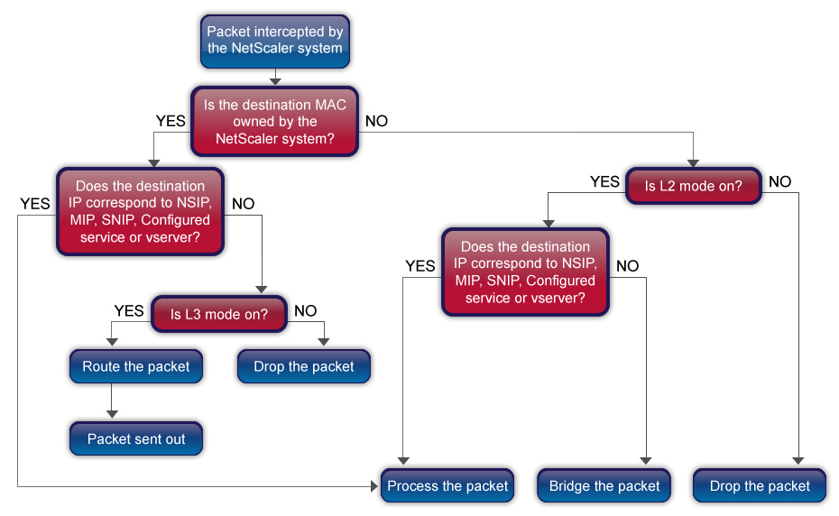

# Packet Forwarding

The NetScaler system can either route or bridge packets that are not destined for an IP address owned by the NetScaler (that is, the IP address is not the NSIP, a MIP, a SNIP, a configured service, or a configured virtual server). By default, layer-3 mode (routing) is enabled and layer-2 mode (bridging) is disabled, but you can change the configuration. The following flow chart shows how the NetScaler evaluates packets and either processes, routes, bridges, or drops them.

