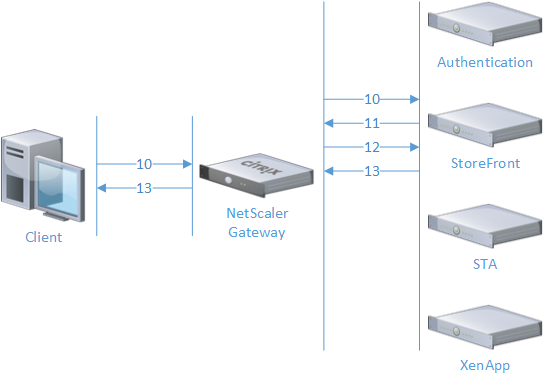

# ICA Proxy Traffic Flow

1. The client sends a request to the FQDN of vpn vserver (HTTP `GET`).

1. The vpn vserver determines the type of the incoming connection to be unauthenticated HTTP and redirects the client to the authentication page (`HTTP 302`; `Location: /vpn/index.html`).

1. The client sends the entered credentials to the vpn vserver (HTTP `POST /cgi/login`).

1. The NetScaler verfies the credentials on the backend.
	1. If a second factor authentication (e.g., RADIUS) server responds with a challenge (i.e., `Access-Challenge`).
		1. The vpn vserver responds with a request for the challenge response (i.e., one-time password) (`HTTP 200`).
		1. The client sends the challenge response to the vpn vserver (HTTP `POST /cgi/dlge`).

1. The vpn vserver sets authentication cookies and redirects the client to a "set client" page based on the HTTP User-Agent header from the client (`HTTP 302`; `Location: /cgi/setclient?cvpn`).

	

1. The client sends the request including authentication cookies (HTTP `GET /cgi/setclient?cvpn`).

1. The vpn vserver determines the type of incoming connection to be authenticated HTTP and redirects the client to `/vpns/cvpnpage.html` (`HTTP 302`).

1. The client sends the request including authentication cookies (HTTP `GET /vpns/cvpnpage.html`).

1. The vpn vserver redirects again to StoreFront (SF) or Web Interface (WI) page via Clienteles VPN: `/cvpn/https/storefront.internal.com/Citrix/StoreWeb` (`HTTP 302`).

	

1. The client sends the request including authentication cookies (HTTP `GET /cvpn/https/storefront.internal.com/Citrix/StoreWeb`).

1. The SF/WI server performs a single sign-on (SSO) call-back to the vpn vserver (HTTP `POST /CitrixAuthService/AuthService.asmx`; `<GetAccessInformation [...]>`).
	- In StoreFront 2.6 and newer, this callback is optional but required for SmartAccess.

1. The vpn vserver responds to SF/WI including any Smart Access information (`HTTP 200`; `<GetAccessInformationResult>`).

1. The SF/WI server enumerates the user's applications and presents them to the client via Clienteles VPN  (`HTTP 200`).

	

1. The user launches (clicks on) an application (HTTP `GET`).
	- Store Front: `/cvpn/https/storefront.internal.com/Citrix/StoreWeb/Resources/LaunchIca/[...]`
	- Web Interface: `/cvpn/https/webinterface.internal.com/Citrix/XenApp/site/launcher.aspx[...]`

1. The SF/WI server constructs and sends an ICA file (`HTTP 200`).
	1. The SF/WI server contacts the XML broker to determine the address of the target server.
	1. The XML broker locates the least-busy server for the chosen application and requests a "Logon Ticket" for that server.
	1. The address of the target server and a corresponding "Logon Ticket" are returned to the SF/WI server.
	1. The SF/WI server sends the target server address, user name, domain name and published application name to the STA server and receives a "Gateway Traversal Ticket" in return.
	1. The SF/WI server renders an ICA file for the user containing the "Gateway Traversal Ticket".
		- `Address` contains the STA information (`;STA_VERSION;STA_SERVER_ID;STA_TICKET`, see below)
		- `SSLProxyHost` contains the FQDN and TCP port number of the gateway

	

1.  Receiver is launched with the ICA file and sends a SOCKSv5 `CONNECT` to the server.
	- `address type` (field 4) is domain name (`0x03`)
	- `destination address` (field 5) is the STA ticket

1. The vpn vserver determines the type of incoming connection to be SOCKSv5 and handles the proxy connection.
	- The NetScaler inspects the connection data to determine the type of connection (protocol) based on a byte sequence signature.
	- If the inspected bytes match a protocol signature, the handler registered with that signature is called.
	- These handles consist of HTTP, SOCKSv5, and CGP.
	- The current implementation assumes that SOCKSv5 and CGP connections are coming from an ICA client.

1. The NetScaler performs a data request by sending the STA ticket back to the STA server and requesting its corresponding data. (`<RequestData>`).

1. The STA server forwards the original data to the gateway. (notably, `<Value name="CGPAddress">` and `<Value name="ICAAddress">`).

1. In the case of Session Reliability (SR), the NetScaler requests a "Refreshable Reconnect Ticket" from the STA server to be used in case the SSL connection is severed. (This reconnect ticket is periodically refreshed while the user’s session is active.)

1. This data is used to complete the subsequent proxy requests from Receiver via SOCKSv5 or CGP.

## STA Ticket Encoding Format
`;STA_VERSION;STA_ID;TICKET`
- `STA_VERSION` - a numeric field identifying the version of the STA.
  - `10` - STA versions 1.0 and 1.1
  - `20` - STA version 2.0
  - `22` - STA version 2.2
  - `40` - STA version 4.0 (Required for Session Reliability)
- `STA_SERVER_ID` - a sequence of 0 - 16 characters representing a hash of the server name.
  - When multiple STAs are shared by a single gateway server, each STA ID must be unique. This allows the gateway to locate the STA that created the ticket and return to that STA for ticket validation. (A ticket created on STA01 will not exist on STA02.)
- `TICKET` - a randomly generated sequence of 32 (uppercase) alphanumeric characters.

# ICA Proxy Reconnection

- In addition to the "Gateway Traversal Ticket" that is used to make the initial connection, when using Session Reliability (SR) or Auto Client Reconnect (ACR), there is an additional ticket that is stored on the endpoint (in memory) that is used to reconnect to the NetScaler without prompting the user for credentials.
  - For ACR, the "ACR Ticket" is issued to Receiver via XenApp / XenDesktop.
  - For SR, the "Common Gateway Protocol Token" is issued to Receiver via the Citrix XTE Service / ICA-CGP Listener.
- After a network interruption, the client initiates a new SSL connection to the NetScaler and presents the STA reconnect ticket.
- If both session reliability and auto client reconnect are enabled, the features work in sequence: ACR will engage after the SR timer has expired.
